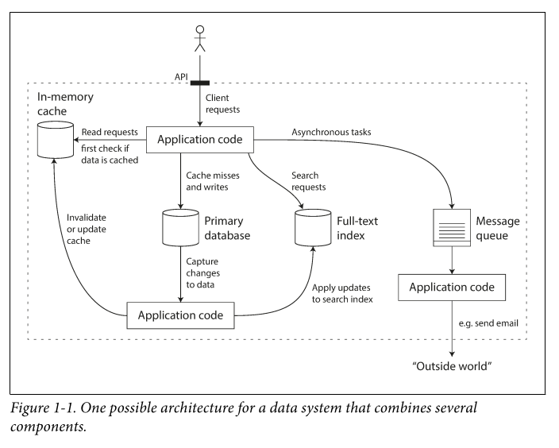

# Designing Data-Intensive Applications 
Kleppmann
2017

## Chapter 01: Reliable Scalable and Maintainable Apps
Apps today are data intensive instead of Compute intensive
- they need to store data so they or another app can find it (DB) 
- Remember the result fo expensive operation (cache) 
- ALlow users to search data by keyword of filter it in various ways (search indexes) 
- send messages to another process to be handled async (stream)
- periodically crunch a large amount of accumulated data (batch)

during design, tricky questions
- how do you ensure data remains correct and complete, even during errors?
- how do you provide good performance, even when degraded
- how do you scale
- what does good API look like

Reliability
- software expectations
    - app performs the functions
    - it can tolerate the user making mistakes or used in unexpected ways
    - performs good enough, despite load
    - prevents unauthz and abuse
- fault != failure
    - fault is 1 component deviating from its spec
    - failure is system as a who stops
    - increase rate of faults to test a fault tolerant system
    - Hardware faults
        - Disk crash, RAM, power outage
        - Mean time to failure (MTTR)
        - used to solve bu adding redundancy, but with cloud scale, it is expensive
    - software errors
        - bugs cause crash
        - runaway processes 
        - service becomes unresponsive
        - cascading failures 
    - Human errors
- How to design for reliability
    - minimized opportunities for errors: well designed abstractions, APIs, interfaces without over designing forcing human to work around
    - decouple
    - add sandboxes for experiments
    - Test thoroughly
    - allow for easy recovery
    - detailed and clear monitoring
    - training

Scalability
- reliable today doesn't mean reliable tomorrow

Maintainability

## Chapter 02: Data Models and Query Languages

## Chapter 03: Storage and Retrieval

## Chapter 04: Encoding and Evolution

## Chapter 05: Replication

## Chapter 06: Partitioning

## Chapter 07: Transactions

## Chapter 08: The Trouble with Distributes systems

## Chapter 09: COnsistency and Consensus

## Chapter 10: Batch Processing

## Chapter 11: Stream Processing

## Chapter 12: The Future of Data Systems

