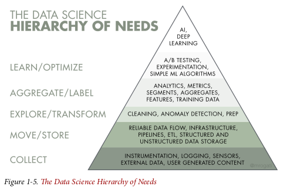
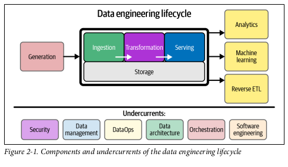

# Fundamentals Of Data Engineering
Joe Reis, Matt Housley

## Part I: Foundation and Building Blocks

### Chapter 01: Data Engineering Described

#### What is Data Engineering

- Data engineering is the development, implementation, and maintenance of systems and processes that take in raw data and produce high-quality, consistent information that supports downstream use cases, such as analysis and machine learning. Data engineering is the intersection of security, data management, DataOps, data architecture, orchestration, and software engineering. A data engineer manages the data engineering lifecycle, beginning with getting data from source systems and ending with serving data for use cases, such as analysis or machine learning.

- Data Engineering vs Data Science
    - DE = Upstream; DS = Downstream 

- Data Science Hierarchy of Needs

- Data from various sources -> Data Engineering -> data Science and analysis

#### Data Engineering Skills and Activities

- Balancing of Data Engineering
    - Cost
    - Agility
    - Scalability
    - Simplicity
    - Reuse
    - Interoperability

- Simplified Data Maturity Model for this book
    1. Starting w/ Data
    2. Scaling w/ Data
    3. Leading w/ Data

- DE Business Responsibilities
    - Know hoe to communicate w/ nontechnical & tech peeps
    - Understand how to scope and gather Business and product requirements
    - Understand the cultural foundation of Agile/DevOps/DataOps
    - Control costs
    - Learn COntinuously

- DE TEch Responsibilities
    - Security
    - Data Management
    - DataOps
    - Data Architecture
    - Orchestrations
    - Software Engineering

- Conttinuoum of DE
    - Type A - Abstraction: uses COTS, doesn't reinvient the wheel
    - TYpe B - Build: build tool and systems; level 2 or 3 in maturity

#### Data Engineering Inside and Org

- Upstream stakeholders
    - Data Architects
    - SEs
    - DevOps and SREs
- Downstream stakeholders
    - Data scientists
    - Data Analysts
    - ML/AI engineers/researchers

- Companies don’t hire engineers simply to hack on code in isolation. To be worthy of their title, engineers should develop a deep understanding of the problems they’re tasked with solving, the technology tools at their disposal, and the people they work with and serve.

### Chapter 02: The Data Engineering Lifecycle

- 5 Phases
    1. Generation
    2. Storage
    3. Ingestion
    4. Transformation
    5. Serving Data

- Data ENgineering lifecycle is a subset of the  Data Lifecycle

#### Phase 1 Generation
- SOurce systems is the origin of data used in the DE lifecycle
    - Evaluating source system: Key considerations
        - What are the essential characteristics of the data sources? Is it an app? a swarm of IoT devices?
        - How is data persisted in the sources system" is data persisted long term or temporary? 
        - At what rate is data generated? How many events/s? GB/hour?
        - What level of consistency can DE expect from output data? if you are running data-quality checks against output data, how often do inconsistencies occur? - nulls, bad formatting, etc. ? 
        - How often do errors occur? 
        - Will the data container duplicates? 
        will some data values arrive late? Possible much later than other messages produced simultaneously? 
        - what is the schema of the ingested data? will DE need to join across many tables or even many system to get a complete picture of the data? 
        - if schema changes, how is this dealt w/ and communicated downstream
        - how frequently should data be pulled from the source system? 
        - For stateful systems, is data provided as periodic snapshots or updated events from change data capture (CDC)? What is the logic for how changes are performed and how are these tracked in the source database? 
        - Who/what is the data provider that will transmit the data for downstream consumption? 
        - will reading from ta data source impact its performance? 
        - Does the source system have upstream data dependencies? what are the characteristics of these upstream systems? 
        - Are data quality check in place to check for late or missing data? 

#### Phase 2 Storage

#### Major Undercurrents across the De lifecycle

### Chapter 03: Designing Good Data Architecture

#### What is Data Architecture

#### Principles of GOod Data Architecture

#### Major Architecture Concepts

#### Examples 

#### Who is involved

### Chapter 04: Choosing Technologies Across the Lifecycle

## Part II: Foundation and Building Blocks

### Chapter 05: Data Generation in Source Systems

### Chapter 06: Storage

### Chapter 07: Ingestion

### Chapter 08: Queries, Modeling, and Transformation

### Chapter 09: Saving Data for Analytics, ML, and Reverse ETL

### Chapter 10: Security and Privacy

### Chapter 11: The Future of Data Engineering

## Appendix A:Serialization and Compression Technical Details

## Appendix B: Cloud Networking

## Index
