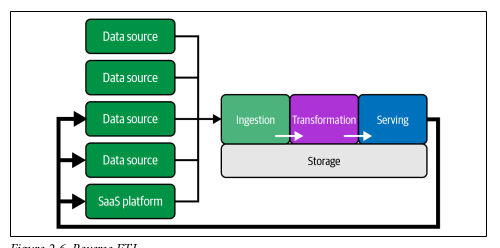
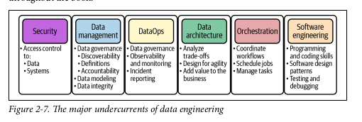

# Fundamentals Of Data Engineering
Joe Reis, Matt Housley

## Part I: Foundation and Building Blocks

### Chapter 01: Data Engineering Described

#### What is Data Engineering

- Data engineering is the development, implementation, and maintenance of systems and processes that take in raw data and produce high-quality, consistent information that supports downstream use cases, such as analysis and machine learning. Data engineering is the intersection of security, data management, DataOps, data architecture, orchestration, and software engineering. A data engineer manages the data engineering lifecycle, beginning with getting data from source systems and ending with serving data for use cases, such as analysis or machine learning.

- Data Engineering vs Data Science
    - DE = Upstream; DS = Downstream 

- Data Science Hierarchy of Needs

- Data from various sources -> Data Engineering -> data Science and analysis

#### Data Engineering Skills and Activities

- Balancing of Data Engineering
    - Cost
    - Agility
    - Scalability
    - Simplicity
    - Reuse
    - Interoperability

- Simplified Data Maturity Model for this book
    1. Starting w/ Data
    2. Scaling w/ Data
    3. Leading w/ Data

- DE Business Responsibilities
    - Know hoe to communicate w/ nontechnical & tech peeps
    - Understand how to scope and gather Business and product requirements
    - Understand the cultural foundation of Agile/DevOps/DataOps
    - Control costs
    - Learn COntinuously

- DE TEch Responsibilities
    - Security
    - Data Management
    - DataOps
    - Data Architecture
    - Orchestrations
    - Software Engineering

- Conttinuoum of DE
    - Type A - Abstraction: uses COTS, doesn't reinvient the wheel
    - TYpe B - Build: build tool and systems; level 2 or 3 in maturity

#### Data Engineering Inside and Org

- Upstream stakeholders
    - Data Architects
    - SEs
    - DevOps and SREs
- Downstream stakeholders
    - Data scientists
    - Data Analysts
    - ML/AI engineers/researchers

- Companies don’t hire engineers simply to hack on code in isolation. To be worthy of their title, engineers should develop a deep understanding of the problems they’re tasked with solving, the technology tools at their disposal, and the people they work with and serve.

### Chapter 02: The Data Engineering Lifecycle

- 5 Phases
    1. Generation
    2. Storage
    3. Ingestion
    4. Transformation
    5. Serving Data

- Data ENgineering lifecycle is a subset of the  Data Lifecycle

#### Phase 1 Generation
- SOurce systems is the origin of data used in the DE lifecycle
    - Evaluating source system: Key considerations
        - What are the essential characteristics of the data sources? Is it an app? a swarm of IoT devices?
        - How is data persisted in the sources system" is data persisted long term or temporary? 
        - At what rate is data generated? How many events/s? GB/hour?
        - What level of consistency can DE expect from output data? if you are running data-quality checks against output data, how often do inconsistencies occur? - nulls, bad formatting, etc. ? 
        - How often do errors occur? 
        - Will the data container duplicates? 
        will some data values arrive late? Possible much later than other messages produced simultaneously? 
        - what is the schema of the ingested data? will DE need to join across many tables or even many system to get a complete picture of the data? 
        - if schema changes, how is this dealt w/ and communicated downstream
        - how frequently should data be pulled from the source system? 
        - For stateful systems, is data provided as periodic snapshots or updated events from change data capture (CDC)? What is the logic for how changes are performed and how are these tracked in the source database? 
        - Who/what is the data provider that will transmit the data for downstream consumption? 
        - will reading from ta data source impact its performance? 
        - Does the source system have upstream data dependencies? what are the characteristics of these upstream systems? 
        - Are data quality check in place to check for late or missing data? 

#### Phase 2 Storage
- where is the data going to be stored

- Evaluating storage systems
    - Considerations
        - Is the storage solution compatible w/ the architecture required write and read speeds? 
        - Will storage create a bottleneck for downstream processes? 
        - Do you understand how this storage tech works? Are you utilizing the storage system optimally or committing unnatural acts; i.e. are you applying a high rate of random access updates in an object storage?
        - Will the storage system handle anticipated future scale? i.e. total available storage, read operation rate, write volume, etc.
        - will downstream users and process be able to retrieve data in the required SLA
        - Are you capturing metadata about schema evolution, data flows, data lineage and so forth? metadata has a significant impact on the utility of the data and represents an investment in the future; dramatically enhancing discoverabilty and institutional knowledge to streamline future projects and architecture changes
        - is this a pure storage solution (obj store) or does it support complex query patterns (cloud data warehouse) 
        - Is the storage system schema-agnostic (obj store), flexible schema (Cassandra), enforced schema (cloud data warehouse) 
        - How are you tracking master data, golden records data quality, and data lineage for data governance? 
        - How are you handling regulatory compliance and data sovereignty? i.e. can you store data in a certain geographic region? 

- Data Access Frequency
    - Hot or Cold data?

#### Phase 3 Ingestion

- Evaluating Ingestion systems
    - Consideration for Ingestion
        - What are the use cases for the data I'm ingesting? Can I reused this data rather than create multiple version fo the same dataset? 
        - Are the system generating and ingesting the data reliably? is the data avaialble when I need it? 
        - What is the data setination after ingestion? 
        - How Frequently will I need to access the data? 
        - In what volume will the data typically arrive? 
        - What format is the data in? Can my downstream storage and transformation systesm handle this format? 
        - Is the sources data in good shape for immediate downstream use? if so, for how long and what may cause it to be unusable? 
        - if the data is from a stream sources, does it need to be transformed before reaching its destination? Would an inflight transform be appropriate (transform the data within the stream)

- Batch Vs streaming
    - streaming for real, near real time (sub 1s) 
    - Batch in constrained by how data is batched
    - choice is based on cost and data timing requirements
    - COnsiderations for batch vs streaming
        - If I ingest the data in real time, can downstream storage system handle the rate of data flow? 
        - DO I need sub 1s data ingestion? WOuld micro batch work (every minute)?
        - what are my use cases for stream ingestion? what specific benefits do I realize by implmenting streaming? if I get data in real time, what action can I take on the data that would be an improvement on batch? 
        - will my streaming-first approach cost more in terms of time, money, maintenance, downtime and opportunity cost rather than simple doing batch? 
        - Are my streaming pipeline and system reliable and redundant if infra fails? 
        - what tools are most appropriate for the use case? Managed services or deploy own instances? Who will manage? 
        - If deploying ML Model, what benefits do I have with online predictions and possible continuous training? 
        - Am I getting data from live prod instances? if so, what is the impact of my ingestion process on the source system? 

- Push vs Pull 
    - push = source system writes data out to a target
    - pull = data is retrieved from the sources system

#### Phase 4 Transformations

- Evaluating Transformation systems
    - Considerations
        - What is the cost and ROI of the transform? What is the associated business value? 
        - Is the transformation as simple and self-isolated as possible? 
        - What business rules do the transformation support? 

- Transforms can be in aby part of the data lifecycle
- Business logic is the main driver for transformation
- Data featureization for ML = extract and enhance data features useful for ML

#### Phase 5 Serving Data
Getting value from the data
- Data has value when used for a purpose

Analytics is the core of most data endeavors
- Opreationaly
    - fine grained details of operations, real time dashboards
- Business Intelligence, ad hoc
    - Describe business past and current state
- Embedded
    - customer facing
    - similar to BI, but w/ different, often more demanding requirements

Serving data for ML Considerations
- Is the data suffiecient quality to perform relable feature engineering? Quality requirements and assessments are developed in close collab w/ teams consuming data? 
- Is the data discoverable? and data scientists and ML Engs easily find valuable data? 
- Where are the technical and organization boundaries between data eng and ML eng? this question has significant architecture implications. 
- Does the data set properly represent ground truth? is it biased? 

Reverse ETL
- Takes processed data from the output side of the data engineering lifecycle and feeds it back into the sources 

#### Major Undercurrents Across the Data Eng Lifecycle

Security
- IAM and timing, right data to right systems for the right amount of times

Data Mgmt
- "Data management is the development, execution, and supervision of plans, policies, programs, and practices that deliver, control, protect, and enhance the value of data and information assets throughout their lifecycle."
- facets of Data mgmt
    - data governance, including accountabilty and discoverability 
        - ENsures quality, integrity, security and usability of the data
        - Metadata types for discoverability 
            - Business metadata: the way the data is used in the business; including data defintions, data rules and logic, how and where data is used, and data owner
            - Technical metadata: describes te data created and used by systems across the Data eng lifecycle; includes data model and schema, data lineage, field mappings, and pipeline workflows. 
            - Operational metadata: operational results of various system and includes stats about the process, job ID, app runtime logs, data used in process and error logs
            - Reference metadata: used to classify or look up data including geo codes, internal codes, measurement units
        - Accountability means who governs a potion of the data
    - data quality
        - 3 characteristics
            - Accuracy: is the data factually correct? are the duplicates? are numeric values accurate
            - Completeness: are records complete? do all required fields contain valid values
            - Timeliness: Are records available in a timely fashion.
        - COnsider nuance
            - avoid misclassifying data
    - data modeling and design: process for convering data into a usable frorm
    - data lineage: describes the recording of an audit trail of data through its lifecycle, tracking systems and upstream data it depends on
    - storage and ops
    - data integration and interoperability: process of integrating data across tools and process
    - data lifecycle mgmt: 
    - data system for advanced analytics and ML
    - Ethics and privacy

DataOps
maps best practices of Agile, DevOps, and statistical process control to data to improve release and quality of data. 

- 3 core tech elements
    - Automation
        - orchestration frameworks like Airflow or Dagster
        - CI/CD
    - Observability and Monitoring
        - avoid bad data
        - Data Observability Driven Development (DODD)
    - Incident Response
        - a way to fix mistakes quickly

Data Architecture

Orchestration

Software Engineering

### Chapter 03: Designing Good Data Architecture

#### What is Data Architecture

#### Principles of GOod Data Architecture

#### Major Architecture Concepts

#### Examples 

#### Who is involved

### Chapter 04: Choosing Technologies Across the Lifecycle

## Part II: Foundation and Building Blocks

### Chapter 05: Data Generation in Source Systems

### Chapter 06: Storage

### Chapter 07: Ingestion

### Chapter 08: Queries, Modeling, and Transformation

### Chapter 09: Saving Data for Analytics, ML, and Reverse ETL

### Chapter 10: Security and Privacy

### Chapter 11: The Future of Data Engineering

## Appendix A:Serialization and Compression Technical Details

## Appendix B: Cloud Networking

## Index
