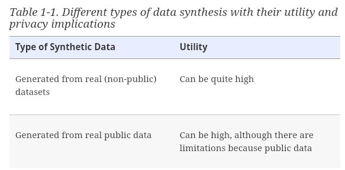
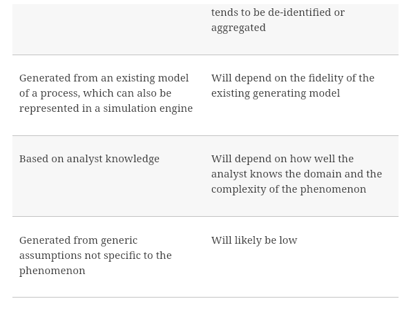

# Practical Synthetic Data Generation
Khaled El Emam, Lucy Mosquera, Richard Hoptroff
June 2020

## Chapter 01: Introduction

### Defining Synthetic Data

What is Synthetic Data
- data generated from real data that has the same statistical properties as the real data.
- this means if an analyst works w/ synth data they should similar results as working w/ real data
- 2 types of synth data
    - synthesized from real datasets: build a model to capture the distributions and structure of that real data. (structure means the multi-variable relationships and interaction in the data)
    - not synthesized from real datasets: Created by using existing models or by using background knowledge of the analyst.  
       
        

Benefits of Synthetic Data
- Access to data for a secondary purpose is problematic
- Privacy concerns
- Access to datasets can be hard
    - Public datasets  may lack diversity
- Real data may not exist
- Most common is privacy and commercial sensitivity reasons prevent access
- Synth data can significantly accelerate AI/ML initiatives
    - can be used to train initial model before it is used on the real data set 

Learning to trusted the Synthetic Data
- In the 90s, synth data was generated w/ proposals to use multiple imputation methods
    - Imputing realistic data when there was missing data
    - analyst must know how the data will be used
    - if the model is different, synth data will not reflect real data
- Statistical machine learning models are used for data synth
    - advantage is they can capture the distributions and complex relationships among variables
    - W/ deep learning synthesis, models can be accurate

Other approaches to access data for AIML projects 
- De-identification
    - Transform to remove PII
    - Works well w/ clearly defined methodologies
    - Lots of manual intervention and additional controls
    - 
- Secure multi-party computation
    - allows computations to be performed on encrypted data and typically involves multiple independent entities that perform that computation collaboratively w/o sharing or leaking raw data among themselves
    - Ways to do this
        - secret sharing techniques: Data is randomly split among the collaborators
        - homomorphic encryption techniques: data are encrypted and computations are performed on the encrypted values

Synthetic Data Case Studies
- Very difficult to de-identify complex datasets
    - re-identification attacks are a thing

## Chapter 02: Implementing Data Synthesis

### Data Synthesis Projects

### The Data Synthesis Pipeline

### Synthesis Program Management

### Best Practices for implementing Data Synthesis

## Chapter 03: Getting Started: Distribution Fitting

### How is Data DIstributed

### Fitting Distributions to Real Data

### Generating Synthetic Data from a Distribution

## Chapter 04: Evaludating Synthetic Data Utility

### Synthetic Data Utility Framework

### Comparing Univariate DIstributions

### COmparing Bivariate Stats

### Comparing Multivariate Prediction Models

### Distinguishability
