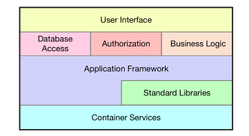
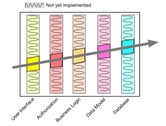
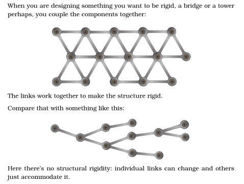
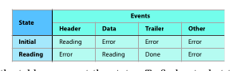
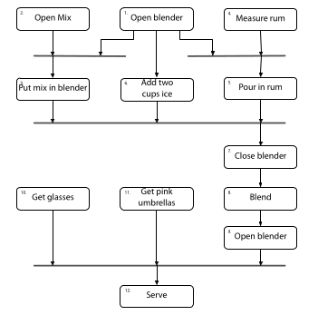

# The Pragmatic Programmer 
author
year

## Chapter 01: A Pragmatic Philosophy

### Topic 01: It's Your Life
You own it. You run it. You create it. 
You have Agency. If you jobs sucks, try to fix it. If you cannot, or they won't let you, move on. 

### Topic 02: The Cat Ate my Source Code
The greatest weakness of all is fear of appearing weak
- take resposnibility for you action
- your team needs to be able to trusted and rely on you
    - and you on them 
- healthy communication is built on trust

Provide options, not excuses
- instead of saying what cannot be done. say what can be done

### Topic 03: Software Entropy
when disorder increases in software, it is call technical debt

1 broken window, left un-repaired for a length of time instills the sense of abandonment. eventually, it becomes a reality. Don't live with broken windows
- bad designs, wrong decisions, poor code

First, do no harm
- don't cause collateral damage
- if code is bad, do not follow suit

### Topic 04: Stone Soup and Boiled Frogs
Soldiers are the catalyst, bringing the village together to build something none could do alone

Be the catalyst for change
- do what you can, show it to peeps, let them marvel and suggest enhancements

Remember the big picture
- constantly review what is happening around you

### Topic 05: GOod enough Software
Nothing will be perfect
- write software good enough for your users, and future maintainers
- it will make you more productive

Involve your users in the Trade-Off
- how good do they want it to be? 

make quality a requirements issue 

Know when to stop
- don't over embellish or overrefine.
- move on and let code run for a bit

### Topic 06: Your Knowledge Portfolio
KNowledge and experience are your most important assets
- but they are expiring
- knowledge becomes out of date

Keep a knowledge Portfolio
1. invest regularly
2. Diversify is key to long term success
3. Balance between conservative and high risk investments
4. buy low, sell high (learning emerging techs before they are popular)
5. review and rebalance

Goals
- learn a new languages every year
- read a tech book every month
- Read nontech books
- Take classes
- Participate ion local meet ups 
- experiment w/ different envs
- stay current

Critically analyze what you read and hear
- Ask 5 whys (ask why 5 times)
- Who does this benefit? 
- WHat is the context
- WHen and where would this work
- Why is this a problem? 

### Topic 07: Communicate
English is jsut another programming language
- Know your audience
- KNow what you want to say, outline
- CHoose you moment, not friday at 6pm
- Choose a style, just the facts? hand holding?
- Make it look good
- Involve you audience
- Be a listener
- Get back to people

It is both what you say and how you say it

Build Documentation In, Don't Bolt it on

## Chapter 02: A Pragmatic Approach

### Topic 08: The Essence of Good Design
Good design is easier to change than Bad design
- ETC: Easier to chage
    - Decoupling is ETC
    - Single responsibility is ETC

ETC is value not a rule

### Topic 09: DRY - the Evils of Duplication
Don't Repeat Yourself
- every piece of knowledge must have a single unambiguous, authoritative representation within a system
- More than code
    - Docs
    - intent
    - Data

Make it easy to Reuse

### Topic 10: Orthogonality
2 lines are orthogonal if they meet at right angles.
- In computing, it means independence or decoupling
- changes to 1 thing do not impact the changes to another thing
    - DB is orthogonal to the user interface

Eliminate effects between unrelated things
Benefits
- Gain Productivity
- Reduce Risk 

Design things in layers

Don't rely on the properties of things you cannot control

Be careful to preserve optionality when introducing 3rd party toolkits and libs

Coding
- Write shy code: do not reveal anything unnecessary to other modules
- Avoid Global Data
- Avoid similar functions

Orthogonal systems are easier to test

same for docs; be able to change appearance without changing content.

### Topic 11: Reversibility

Nothing is forever
There are no final decisions, so make things easier to change
- small components instead of monoliths
- hide 3rd party API behind an abstraction layer

Forgo following fads

### Topic 12: Tracer Bullets
In code, we look for something that gets us from a requirement to some aspect of the final system quickly, visibly and repeatably
- Look for important requirements that define the system
- look for areas where you have doubts and the biggest risks

For example, ths system has 5 architecture layers and we have concerns about how they'd integrate, so we look for a simple feature that will exercise them together

Tracer code is not meant to be disposable

Advantages
- Users get to see something early
- Devs build a structure to work in
- You have an integration platform
- You have something to demonstrate
- You have a better feel for the process

Tracers may miss

Tracer code != prototyping
- prototyping you are aiming to explore a specific aspect of the final system. You will kludge to see that aspect, and if it works, throw it away and do it properly
    - disposable, reconn
- tracer shows how the app as a whole hangs together
    - lean but complete

### Topic 13: Prototypes and Post-it Notes
what to prototypes? 
- anything that carries risk
- anything you haven't tries before
- anything critical to the final system

Prototype to learn
- Architecture
    - Are responsibilities of the major areas well defined and appropriate? 
    - are the collaborations between major components well defined
    - is coupling minimized
    - can you ID potential sources od duplicating
    - are interface definitions ans constraints acceptable
    - does every module have an access path to the data it needs?
- New functionality
- structure of contents of external data
- 3rd party tools or components
- performance issues
- user interface designs

What can you ignore
- correctness
- completeness
- robustness
- style

do not prototype if there is a culture of implementing the prototype; tracer bullet instead

### Topic 14: Domain Languages
static vs dynamic typing
early vs late binding
functional vs OOO

always write code using the vocabulary of the application domain

Program close to the problem Domain

Trade off between internal and External languages
- internal can take advantage of features of its host language
    - but bound by syntax and semantics of host languages
- external languages are not bound by syntax

### Topic 15: Estimating

Estimate to avoid surprises

How accurate is accurate enough? 
- duration is 1-15 days, quote estimate in Days
- duration is 3-6 weeks, quote estimate in Weeks
- duration is 8-20 weeks, quote estimate in months
- duration is 20+ weeks, think hard before estimating

Where do estimates come from
- ask some one who has already done it. 
- Understand what is being asked
- Build a model of the system
- Decompose the model into components
    - Each component will have parameters
- Give each Parameters a value
- Calculate 

Keep track of your estimation prowess and refine

Estimate with a range of scenarios

PERT
- Program
- Evaluation
- Review
- Technique
Every PERT task as an optimistic, most likley, pessimistic estimate

Best way to estimate, is to gain experience through incremental development
- check requirements
- analyze risk (prioritize riskiest first)
- design, implement, integrate
- Validate with users

Iterate the schedule w/ the code

## Chapter 03: The Basic Tools

Tools amplify talent

### Topic 16: The Power of Plain Text

Keep knowledge in Plain text
- Insurance against Obsolescence 
- every tool can operate on plain text

easier to test plain text 

### Topic 17: Shell Games

Use the Power of command shells
make it your own

### Topic 18: Power Editing

Achieve Editor Fluency

think, "There must be a better way to do this"

### Topic 19: Version Control
Use it

use branches for isolation

Version Control as a Project Hub for a team

### Topic 20: Debugging

Debugging is just problem solving, not blame
- Fix the problem, not the blame
- Even for yourself
- Don't Panic

Always start w/ code built cleanly w/o warnings
Gather all relevant data
Reproduce the bug with a single command

failing Test before fixing code
- write the test first

Read the damn Error message!! 

Make sure it is not just a bad result
Sensitivity to input values
- binary chop the data until you find the offending input 

Regression test across releases to make sure it is not reintroduced

Add logging and tracing

Rubber Ducking

Remember the system is most likely not broken

Don't Assume it - Prove it
- prove your bug is fixed

### Topic 21: Text Manipulation

Learn text manipulation language
- Awk
- sed
- perl

### Topic 22: Engineering Daybooks
a kind of journal
- what they did
- things they learned
- sketches of ideas
- readings from metes
- anything to do w/ work

- take notes in meetings
- variables values
- reminders
- doodles

## Chapter 04: Pragmatic Paranoia
You cannot write perfect software

### Topic 23: Design by Contract 
Contract defines rights and responsibilities of all parties

For software, that means
- rights and responsibilities for modules 
- Define Preconditions
- Define Post conditions
- Class invariants (state)

Implement
- enumerate the input domain range
- what the boundary conditions are
- what the routine promises to deliver
- what the routine will not deliver

Use Assertions (runtime checks) to check 

### Topic 24: Dead Programs Tell No Lies
If there is an error, there is an error

Catch and release is for Fish
- If you catch and exception, do something w/ it

Crash Early; don't continue

### Topic 25: Assertive Programming

Use Assertions to prevent the impossible

don't use in place of real error handling though

Leave Assertions on
- if there is a performance problem, only turn off the offender

### Topic 26: How to Balance Resources

Finish what you start
- deal w/ allocated resources

Act Locally
- Deallocate in the opposite order you allocate
- allocate the same set of resources in different places in the same order

BUild code that checks that resources are freed appropriately

### Topic 27: Don't Outrun your Headlights

Take small steps - always
Check for feedback, and adjust before the next step. 

Avoid Fortune Telling

## Chapter 05: Bend, or Break

### Topic 28: Decoupling
coupling is the enemy of change

Train wrecks - Chains of method calls
Globalization - Dangers of static things
    - Avoid global accessible data
    - Includes singletons
    - If it is important enough to be global, wrap it in an API
Inheritance - why subclassing is dangerous

Look for the signs
- wacky dependencies between unrelated modules or libs
- simple changes to one module that propagate through unrelated modules
- devs who are afraid to change code b/c they aren't sure what might be affected
- meetings where every one has to attend b/c no one is sure who will be affected

Tell, don't ask
- you shouldn't make decisions based on the internal state of an object

Law of Demeter: says a method in C should only call: 
- other instance methods in C
- its parameters
- Methods in objects that it creates, both on the stand and in the heap
- Global variables

### Topic 29: Juggling the Real World
Events: the availability of information.

Strategies to write apps to respond to events
- Finite State Machines
    - a spec on how to handle events
    - set of states
    - Make a table
        - Columns are events, rows are states
        
        - Intersection is actions
- The Observer Pattern
    - has a list source of events, the observable
    - has a list of clients, the observers
    - Can introduce performance bottleneck
- Publish/Subscribe
- Reactive Programming and Stream

### Topic 30: Transforming Programming
all programs transform data, converting inputs to outputs; but we rarely think of it this way when we design apps

Programming is about code, but programs are about data

Don't hoard state, pass it around
- think of data as the flow

Never pass raw values between transformations; wrap in a data structure or type

### Topic 31: Inheritance Tax

inheritance is coupling
- Child class to parent, parent's parent, etc.
- code that uses child is couple to all the ancestors

Alternatives
- INterfaces and protocols
    - Prefer interfaces to express polymorphism
- Delegation
    - Delegate to Services: Has-A trumps Is-A
- Mixins and traits
    - Use Mixins to share functionality

### Topic 32: Configuration
keep values that may change external to the app
Parameterize you ap using external configuration
- creds for external services
- Logging levels and desitnations
- port, IP, machine and cluster names
- Env-specific validation parameters
- externally set parameters, i.e. tax rates
- site specific formatting details
- license keys

Static config - flat files, JSON, YAML
Configuration as a Service - service API to access config
- Multiple apps can share config info with auth and access control limiting 
- config changes can be made globally
- configuration data can be maintained via specialized UI
- config data can become dynamic
    - critical for HA

Without external config, code is not adaptable

## Chapter 06: Concurrency
everything is concurrent

### Topic 33: Breaking Temporal Coupling
aspects of time we care about
- things happening at the same time
- ordering or relative position of things in time

analyze workflow to improve concurrency
- create activity diagrams to maximize parallelism

concurrency is a software mechanism, and parallelism is a hardware concern.

### Topic 34: Shared State is Incorrect state

avoid non-atomic updates
- a semaphore is a thing that only 1 person can own at a time
    - create a semaphore, use it to control access to some other resource

Problems can pop up any where resources are mutable:
- files, DBs, external services, etc. 

Random failures are of then concurrency issues. 

### Topic 35: Actors and Process
actor is an independent virtual processor with its own local and private state. Each actor has a mailbox. When a message appears in the mailbox and the actor is idle, it kicks into life and processes the message. When it finishes, it processes another message in the mailbox or it goes back ro sleep. 
- when processing a message, an actor can create other actors, send messages to other actors and create a new state that will become the current state when the next message is processed

Process is a more general purpose virtual processor, often implemented by the Operating system to facilitate concurrency. Processes can be constrained to behave like actors

Actors can only be concurrent
- No single things is in control
- the only state is help in messages and in the local state of an actor
- all messages are 1 way;l there is not reply
- an actor only process 1 message at a time, to completion. 

### Topic 36: Blackboards
another concurrency method
features
- no one needs to know the existence of any one else, they watch the board for info and add their findings
- each person can be trained in different disciplines, the share a single desire only
- each person comes and goes as needed
- no restriction for what can go on the black board.  

use blackboards to coordinate workflow

## Chapter 07: While You are Coding
Coding is not mechanical

### Topic 37: Listen to your lizard brain
instincts are a response to patterns packed into our noncontagious brain
- The trick is to notice it is happening, and then work out why

Fear the blank page
- 2 reasons of this fear
    - doubt 
    - afraid to make a mistake

if code is harder than is should, something may be wrong
- structure or design is wrong
- solving the wrong problem

stop and give yourself time and space to organize your brain
- step away from code: take a walk, lunch, chat, doodle
- You cannot force it
- Create a comment describing in one sentence what you want to do or learn

### Topic 38: Programming by coincidence
be wary of drawing false conclusions
Program deliberately

close enough, isn't

don't assume it, prove it. 

How to program deliberately
- always be aware of wha you are doing
- Can you explain the code in detail to a Jr dev?
- don't code in the dark; if you do not know why is works, you will not know why if fails
- proceed from a plan
- rely only on reliable things
- document your assumptions
- test your code and your assumptions
- prioritize your effort; spend time on important aspects
- Don't be a slave to history.

### Topic 39: Algorithm speed

### Topic 41:

### Topic 42:

### Topic 42:

### Topic 43:

### Topic 44:

## Chapter 08: Before the Project

### Topic 45:

### Topic 46:

### Topic 47:

### Topic 48:

## Chapter 09: Pragmatic Projects

### Topic 49:

### Topic 50:

## Chapter 10: 

