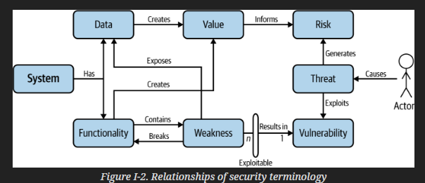
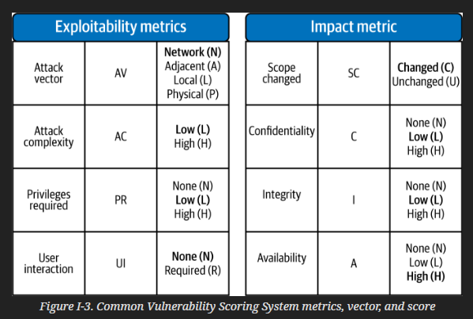

# Threat Modeling: A Practical Guide 
Tarandach, Izar; Coles, Matthew
2020

## Introduction
Threat modeling is the process of analyzing a system to look for weaknesses that come from less desirable design choices. 

TM is a cyclic activity

DOn't shift left, start left

Developing a secure system
1. idea inception
2. design
3. implementation
4. testing
5. deployment
6. repeat

Terminology

- Weakness is an underlying defect that modifies behavior or functionality or allows incorrect access to data
- Exploitability is a measure of how easy an attacher can make use of a weakness to cause harm
- Vulnerability is a when a weakness is exploitable 
- Severity is the damage potential from an defect
    - part art, part science
- Impact is measure of loss of functionality or data 
- Actor is any individual associated w/ the system 
- Threat is the result of an actor taking advantage of a vulnerability
- Threat event is a success exploitation of a vulnerability
- Loss is when 1 or more impacts happen b/c of threat event
- Risk combines the value of the p

Calculating Risk
- CVSS

- DREAD - qualitative risk calculation
    - Damage
    - Reproducibility
    - Exploitability
    - Affected Users
    - Discoverability
FAIR - Factor analysis of Information Risk
    - Quantitative risk

Core Properties
- COnfidentiality
- Integrity
- Availability
- Privacy
- Safety

Fundamental Controls
- Identification
- Authentication
- Authorization
- Logging
- Auditing

Basic Design Patterns
- Zero Trust - Verify trusted every time
- Design by Contract
- Least Privilege 
- Defense in Depth
- KISS
- No Secret sauce - do not rely on "security by obscurity"
- Separation of privilege
- COnsider the human factor
- Effective logging
- Fail secure
- Build in, not bolt on

## Chapter 01: Modeling Systems

## Chapter 02: A Generalize Approach to Threat Modeling

## Chapter 03: Threat Modeling Methodologies

## Chapter 04: Automated Threat Modeling

## Chapter 05: COntinuous Threat Modeling

## Chapter 06: Own Your ROle as a Thread Modeling Champion

